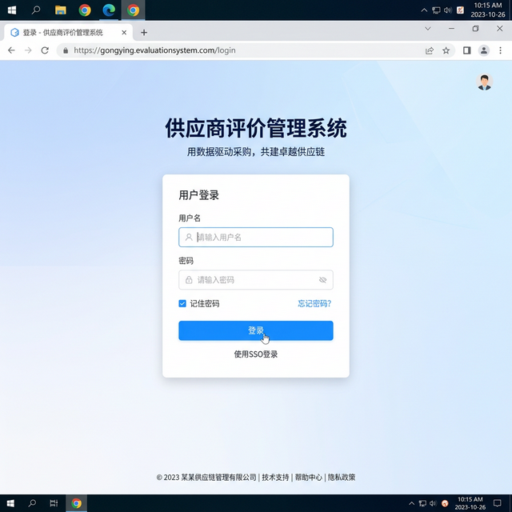

# 供应商评价管理系统

企业在选择和管理供应商时，需要对供应商的服务质量、交货能力、价格水平等进行系统化评价和记录。传统的 Excel 表格记录方式分散、不便共享、无法多人协作，查找历史评价记录也很麻烦。本项目搭建了一套 Web 化的供应商评价管理系统，支持供应商信息管理、评价打分、公告发布等功能，前后端分离架构方便部署和扩展。

## 痛点与目的

- **问题**：供应商评价数据散落在各部门的 Excel 或纸质表格中，无法统一管理、实时查看和汇总分析，评价标准不统一
- **方案**：用 SpringBoot 做后端 API + Vue.js 做前端页面，搭建一个前后端分离的供应商评价管理平台，数据集中存储在 MySQL
- **效果**：管理员可以增删改查供应商信息和评价记录，支持文件上传、公告管理，前台用户可以浏览评价结果

## 系统界面



## 核心功能

- **供应商管理**：供应商信息的增删改查
- **评价管理**：对供应商进行评分和评价记录
- **公告管理**：发布和管理系统公告
- **文件上传**：支持附件和文档上传
- **用户认证**：基于 Token 的登录认证
- **前后台分离**：管理后台和用户前台独立页面

## 技术架构

```
Vue.js 前端（Element UI）
    ↓ HTTP API
SpringBoot 后端（MyBatis）
    ↓ JDBC
MySQL 数据库
```

## 使用方法

### 后端启动

1. 导入 `service.sql` 到 MySQL 数据库
2. 修改 `service/src/main/resources/application.properties` 中的数据库连接信息
3. 启动 SpringBoot 后端：

```bash
cd service
mvn spring-boot:run
```

### 前端启动

```bash
cd vue
npm install
npm run serve
```

浏览器访问 `http://localhost:8080` 进入系统。

## 项目结构

```
.
├── service/                              # SpringBoot 后端
│   ├── src/main/java/com/lantu/
│   │   ├── controller/                   # 接口控制器
│   │   │   ├── ProviderController.java   # 供应商接口
│   │   │   └── FileController.java       # 文件上传接口
│   │   ├── entity/                       # 数据实体
│   │   │   ├── ProviderEntity.java       # 供应商实体
│   │   │   └── EvaluationEntity.java     # 评价实体
│   │   ├── mapper/                       # MyBatis 映射
│   │   ├── service/                      # 业务逻辑
│   │   ├── util/                         # 工具类（Token等）
│   │   └── common/                       # 通用返回结果
│   ├── src/main/resources/
│   │   └── application.properties        # 配置文件
│   └── pom.xml                           # Maven 依赖
├── vue/                                  # Vue.js 前端
│   ├── src/
│   │   ├── views/
│   │   │   ├── manager/                  # 管理后台页面
│   │   │   │   ├── Home.vue              # 首页
│   │   │   │   ├── Book.vue              # 供应商管理
│   │   │   │   └── Notice.vue            # 公告管理
│   │   │   ├── Manager.vue               # 后台布局
│   │   │   └── Front.vue                 # 前台布局
│   │   ├── router/index.js               # 路由配置
│   │   └── utils/request.js              # Axios 请求封装
│   └── package.json
└── service.sql                           # 数据库初始化脚本
```

## 适用场景

- 企业供应商评价管理
- 采购部门供应商考核
- 内部评审打分系统
- JavaWeb 全栈开发学习

## 技术栈

| 层级 | 技术 |
|------|------|
| 前端 | Vue.js, Element UI, Axios |
| 后端 | SpringBoot, MyBatis |
| 数据库 | MySQL |
| 认证 | Token (JWT) |
| 构建 | Maven, npm |

## License

MIT License
